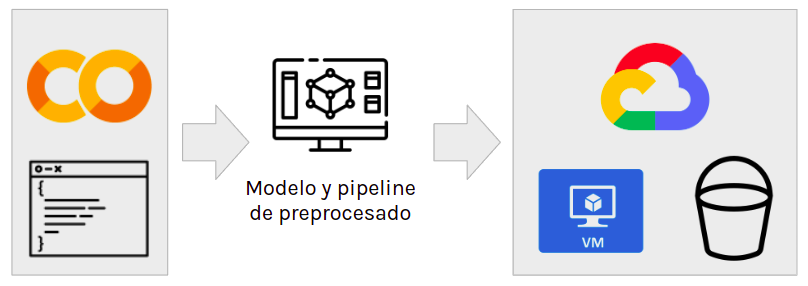
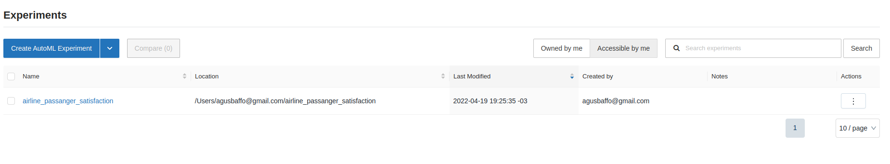
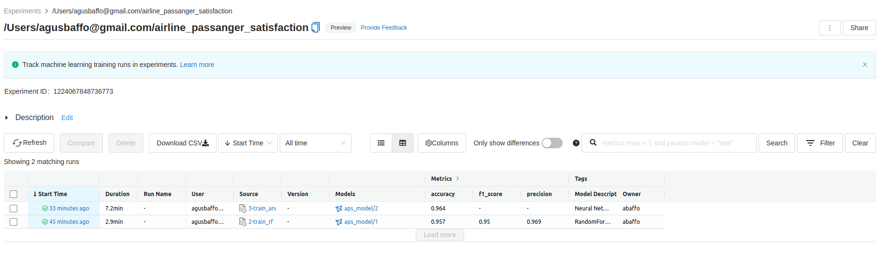
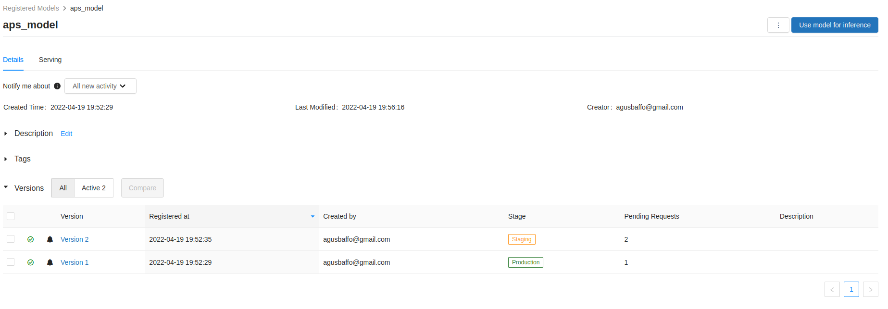
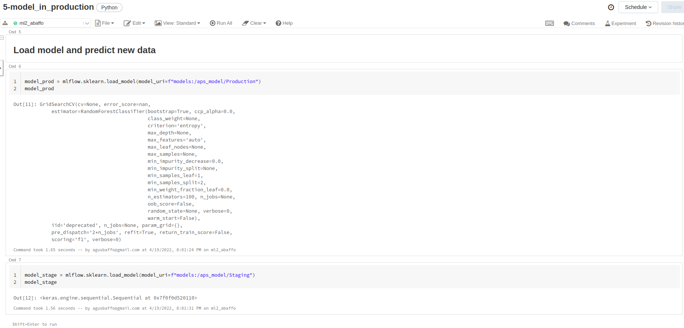
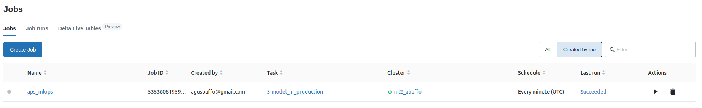
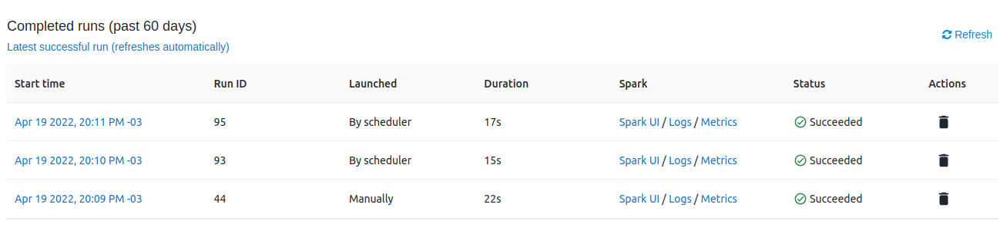

Este repositorio contiene dos trabajos de MLOps en [Google Cloud Platform](https://console.cloud.google.com/) (GCP).

## 1. Predicciones en tiempo real (VM+Bucket)

En la carpeta [1_gcp_real_time_prediction](./1_gcp_real_time_prediction) se encuentran los archivos necesarios para ralizar las predicciones de un modelo en tiempo real, en Cloud. Para esto, se debe instanciar una Maquina Virtual y un Bucket en GCP. En el directorio raiz del Bucket, se depositan los nuevos datos a predecir de manera asincrónica y en la carpeta `output` se obtienen las predicciones. La VM ejecuta un script de Python que hace polling sobre el Bucket y al encontrar nuevos archivos de datos (de extensión csv), registra los nombres en el archivo de texto `new_data_filenames.txt`. Luego dichos datos son cargados y procesados también en la VM, quien escribe los resultados en al carpeta output.

    

Tanto el análisis y preprocesado de datos como el entrenamiento de los modelos fue realizado en este [Notebook de Google Colab](https://drive.google.com/file/d/1FkrAteGgGobZG2uPTdYYbVZLy0kSKoGX/view?usp=sharing). Luego, los modelos y demás archivos necesarios fueron subidos a la VM de GCP, para realizar predicciones en Cloud.

Los archivos son los siguientes:
- [airline-passenger-satisfaction.ipynb](./1_gcp_real_time_prediction/airline-passenger-satisfaction.ipynb): es el notebook con el análisis de datos y donde los modelos fueron entrenados.
- [real_time_prediction_cloud.py](./1_gcp_real_time_prediction/real_time_prediction_cloud.py): es un script que se ejecuta en la VM, polea los datos del Bucket, realiza las predicciones y escribe el resultado en el Bucket.
- [real_time_prediction.py](./1_gcp_real_time_prediction/real_time_prediction.py): tiene la misma funcion que `real_time_prediction_cloud.py` pero de manera local (en SO Ubuntu).
- [preprocess.pickle](./1_gcp_real_time_prediction/preprocess.pickle): archivo binario con los transformeners necesarios de sklearn para el preprocesado de datos.

Nota: el modelo `ariline_passanger_satisfaction_model_rf.pickle` no fue subido al repositorio porque excede el tamaño permitido.

En el siguiente gift se puede ver el resultado de la ejecución:

    

## 2. Versionado de modelos con Databricks

En la carpeta [2_databricks](./2_databricks) se encuentran los notebooks de un trabajo realizado con [Databricks](https://databricks.com/). Con fines didácticos, se propuso realizar el proceso completo desde análisis y preprocesamiento de datos, hasta el entrenamiento y puesta en producción de un modelo. Para esto se utilizó [MLFlow](https://mlflow.org/) para realizar experimentos en los entrenamientos y versionado de modelos.

Los notbooks son los siguientes:
- [1-analysis_and_preprocessing.ipynb](./2_databricks/1-analysis_and_preprocessing.ipynb): Análisis y preprocesado de datos.
- [2-train_rf.ipynb](./2_databricks/2-train_rf.ipynb): Entrenamiento de un modelo Random Forest (sklearn)
- [3-train_ann.ipynb](./2_databricks/3-train_ann.ipynb): Entrenamiento de una red nueronal (TensorFlow/Keras)
- [4-predictions.ipynb](./2_databricks/4-predictions.ipynb): Predicciones con ambos modelos. Además se registran los modelos para su puesta en producción.
- [5-model_in_production.ipynb](./2_databricks/5-model_in_production.ipynb): Predicciones de modelos en tiempo real, tanto con modelo en **producción** como en **stage**.

### Proceso: 
### 1_ Análisis y preprocesado:
En primer lugar se cargan los datos, se realiza el análisis y preprocesado y se guardan tanto los datos preprocesados como los transformers de sklearn en archivos binarios tipo `pickle` (en el notebook: [1-analysis_and_preprocessing.ipynb](./2_databricks/1-analysis_and_preprocessing.ipynb)). 
Antes de realizar el entrenamiento de los modelos en los notebooks [2-train_rf.ipynb](./2_databricks/2-train_rf.ipynb) y [3-train_ann.ipynb](./2_databricks/3-train_ann.ipynb), se debe crear un nuevo experimento de MLFlow, a fin de tener un seguimiento de sus métricas y su evolución.

    

    

### 2_ Entrenamiento y seguimiento con MLFlow:

En el cuaderno [4-predictions.ipynb](./2_databricks/4-predictions.ipynb) se testean los modelos sobre un conjunto de datos nuevos, y se los registra en MLFlow para poder utilizarlos en producción de manera dinámica. Se asume que el modelo de RandomForest esta testeado y se lo pasa a `Producción`, mientras que el modelo de Redes Neuronales queda en etapa de `Stage` para realizarle un seguimiento antes de llevarlo a Producción.

    

    

### 3_ Puesta en producción (JOBS)
El cuaderno [5-model_in_production.ipynb](./2_databricks/5-model_in_production.ipynb) es similar al anterior pero los modelos se tratan de manera genérica como `Producción` y `Stage`. Notese que estos modelos pueden ser intercambiadios fácilmente desde la interfaz gráfica de MLFlow, moviendo uno o el otro a Producción o Stage, según se deseara (ver figuras del punto anterior). Finalmente, utilizando las herramientas de [JOBS](https://docs.databricks.com/data-engineering/jobs/index.html) de Databricks se crean tareas cíclicas que ejecutan este cuaderno cada 1 minuto, realizando predicciones en tiempo real.

    

    

